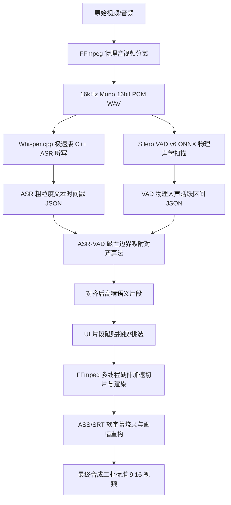

# 🔱 AutoCut Matrix AI 极速离线版
## 官方技术白皮书与系统使用主手册 (v9.5.2)


> [!NOTE]
> **AutoCut Matrix AI** 是一款专为自媒体、短视频高频创作（TikTok/抖音/短视频）设计的**工业级精密视频自动化语义切片系统**。系统完全摒弃传统视频画质波动检测，以 **Whisper.cpp C++ 离线听写中枢** 与 **ONNX Silero VAD 物理声学边界扫描** 为双核心，辅以 **Obsidian Red 2.0** 深色磨砂玻璃工业美学界面，为专业剪辑师提供从 AI 语义检索、智能画幅重构到多轨高速合成的全链路离线解决方案。

---

## 🗺️ 第一部分：系统总体架构与数据流向

本系统遵循**“物理隔离运行，数据完全主权”**的极致离线设计哲学。整个 ASR + VAD 对齐与视频重构的物理拓扑结构如下：



### 📂 项目目录物理结构规整

```text
autocut/
├── 00_AutoCut_Matrix_AI_官方技术白皮书与使用主手册.md  <-- [本主手册]
├── 01_项目总体设计与开发指引.md
├── 02_软件用户使用手册.txt
├── 03_软件安装激活手册.txt
├── 04_开发编译打包方案说明.txt
├── 05_系统架构设计分析.md
├── 06_DeepSeek智能切分算法.md
├── 07_系统开发迭代日志.md
├── 08_软件授权鉴权流程设计.md
├── 09_软件授权术语审计.md
├── 10_ASR架构重构日志.md
├── 11_打包版本发布声明.html
├── _internal/               # STANDALONE 离线套件 (FFmpeg、CUDA DLL、VAD ONNX)
│   ├── ffmpeg.exe           # FFmpeg 静态二进制 (223 MB)
│   ├── silero_vad_v6.onnx   # Standalone 物理声学 VAD 模型 (1.24 MB)
│   ├── face_detection_full_range_sparse.tflite # MediaPipe 人脸追踪模型
│   └── cublas64_12.dll 等    # 英伟达 CUDA 物理加速动态链
├── models/
│   └── whisper-cpp/         # Whisper.cpp 极速 GGML 模型目录
│       ├── ggml-tiny.bin    # 77 MB 极速模型
│       ├── ggml-small.bin   # 487 MB 标准推荐模型
│       └── ggml-large-v3-turbo.bin # 1.62 GB 高精旗舰模型
├── workdir/                 # 工业工作区：按项目 ID 管理物理资产
│   └── [PROJECT_ID]/        # 项目容器 (例如: 1, 2, 3...)
│       ├── in/              # 原始素材存放处
│       ├── temp/            # AI 索引、缩略图、原子索引 (JSON)
│       └── out/             # 最终合成的工业标准 MP4
```

---

## 🛠️ 第二部分：软件安装、激活与环境自愈

### 1. 物理环境解压与部署
1. **系统要求**：Windows 10/11 64位系统。显卡支持英伟达（NVIDIA）加速可获得 20x 听写提速，无独立显卡亦支持 CPU 极速运行。
2. **解压部署**：直接将软件压缩包解压到本地文件夹中。
   > [!IMPORTANT]
   > 为确保 FFmpeg 路径转义的绝对健壮，**严禁**将解压目录放置在包含中文、空格或特殊字符的磁盘路径下！推荐路径如：`E:\autocut\`。

### 2. HWID 安全激活与防盗机制
系统采用基于物理特征的 HWID 离线锁定算法，严格防范商业破解与资产流失。
1. **生成机器码**：双击运行 `autocut.exe` (或在开发环境下运行 `python acut_server.py`)。如果首次运行或授权失效，系统将抛出 HWID 锁定拦截，并自动在剪贴板生成机器码。
2. **激活流程**：
   - 点击右上角“授权”浮窗；
   - 在输入框中粘贴获取的授权卡密（LICENSE KEY）；
   - 点击“激活”按钮，系统原子化写入本地 `license.bin` 配置文件；
   - 首次激活需要短暂联网握手验证，激活成功后，后续系统将进入 **100% 物理隔离离线运行模式**。

### 3. 环境智能自愈系统 (Environment Self-Healing)
为了彻底解决 Windows 用户因 CUDA/cuDNN DLL 文件缺失而无法开启英伟达显卡加速的痛点，系统集成了**“一键环境自愈”**机制：
- **触发入口**：当系统后台探测到英伟达 GPU 但 ASR 无法唤起 CUDA 模式时，前台界面会触发紫色闪愈警报。
- **运行逻辑**：点击“环境自愈”，系统在后台自动拉起独立的修复子进程，通过清华大镜像通道极速拉取并安装 `nvidia-cublas-cu12` 与 `nvidia-cudnn-cu12` 运行时库，并自动将其 `bin/` 和 `lib/` 注入 Windows DLL 重定向链，实现**零配装、零代码背景的硬件加速自恢复**。

---

## 🎨 第三部分：Obsidian Red 2.0 工业级前端设计

本系统全面贯彻 **Obsidian Red 2.0** 工业美学，以极客磨砂玻璃、超高对比度猩红状态指示灯与动态平滑过渡微动画为视觉底座：

```text
+-------------------------------------------------------------------------+
| [一刀不剪 Matrix AI v9.5]                 [CUDA 加速开启 🟢] [授权有效 🔐]  |
+-------------------------------------------------------------------------+
| [ 1. 导入视频 ]  -->  [ 2. 物理声学 ASR 扫描 ]  -->  [ 3. 黄金语义片段分选 ]  |
+------------------------------------+------------------------------------+
|                                    |   💡 AI 语义磁贴工作区               |
|                                    |   +----------------------------+   |
|            9:16                    |   | [X] 片段 1 (0.0s-4.2s)     |   |
|         专业预览窗口                |   | "今天给大家带来一期干货..." |   |
|                                    |   +----------------------------+   |
|                                    |   | [X] 片段 2 (4.2s-12.0s)    |   |
|                                    |   | "首先我们把依赖包解压..."   |   |
|                                    |   +----------------------------+   |
|                                    |   | [ ] 片段 3 (12.0s-15.5s)   |   |
|                                    |   | "（吸气/无意义空转静音）"    |   |
|                                    |   +----------------------------+   |
+------------------------------------+------------------------------------+
| [  添加背景音乐 🎵  ]   [  ASS 软字幕烧录 📝  ]  [  开始原子化高速合成 🚀  ] |
+-------------------------------------------------------------------------+
```

### 💎 五步经典工业流水线操作：
1. **拖拽导入 (Import)**：直接将本地视频/音频文件拖拽至界面中央的“资源磁铁区”，系统会在 `workdir` 下为视频分配唯一的 UUID 任务容器，并自动提取音频。
2. **AI 自检与同步听写 (ASR Audit)**：系统通过 Socket.IO 发射实时自检数据流。C++ 听写引擎开始多线程处理（默认智能分配 `半核心数` 线程，最高 4 线程），将高精度分片进度回传前台。
3. **磁贴交互与排序 (Tile Selection)**：分析出的字幕文本与声学区间以 **“可交互语义磁贴”** 形式呈现。
   - **点亮磁贴**：片段被选中加入导出队列；
   - **熄灭磁贴**：片段被丢弃（实现一键切除无意义语气词、吸气声和静音空白区）；
   - **拖拽排序**：支持片段的任意顺序重排，实时改变最终视频的叙事逻辑。
4. **效果精细调控 (Effect Control)**：
   - **智能防抖追踪 (Sticky Face Crop)**：当开启 AI 画幅重构时，系统以 MediaPipe 模型在 0.1s 偏移处抓取人脸特征，以**动态阻尼防抖算法**重新锁定构图，将 16:9 横屏平滑切为 9:16 竖屏。
   - **ASS 软字幕烧录**：基于视觉权重算法进行字幕自动换行断句，以 `playres` 25% 的黄金 bottom 边距烧录微软黑体粗体字幕。
5. **原子化一键合成 (Atomic Synthesis)**：点击“开始合成”，FFmpeg 启动硬解码切片，并以 `save_json_atomic` 对配置文件和进度实施强物理保护，严防死锁与损坏。

---

## 🧠 第四部分：核心 AI 引擎算法与物理对齐

### 1. 双 AI 磁性吸附对齐算法 (ASR-VAD Fusion)
听写引擎（ASR）的识别边界往往由于发音黏连而产生毫秒级的偏移，导致剪切视频时产生“吞字”或“破音”。系统开创性地引入了 **VAD（语音活动检测）** 进行物理声学边界吸附：

```text
ASR 文本边界:   [--- 今天给大家分享一下 ---] (发音黏连，边界模糊)
VAD 声学边界:     [-- 实际人声物理起止 --]    (精准物理声波起止点)
                         |         |
                      (磁性吸附对齐)
                         v         v
物理切片点:       [-- 完美无杂音视频片段 --]
```

- **实现机制**：通过 `silero_vad_v6.onnx` 进行 16kHz 原始音频帧的高速声学扫描。
- **自愈过滤**：将 VAD 扫出的物理发音区间与 ASR 字幕区间进行交叉重合度（IoU）评估，自动向人声真实起止点进行**毫秒级吸附时间戳修正**，完全切除吸气声与环境杂音。

### 2. DeepSeek Elite Selector 智能筛选算法
在长视频切片场景下，剪辑师需要花费大量时间阅读字幕。系统集成了离线/在线双模 **DeepSeek 核心语义分拣算子**：
- **逻辑分拣**：一键将成千上万行字幕通过精简提示词提交给大模型；
- **密度分析**：大模型自动剔除废话，仅点亮含金量最高、逻辑连贯的“知识干货片段”，自动为剪辑师完成 80% 的粗剪工作。

---

## 📦 第五部分：工业级编译、打包与防臃肿隔离

系统提供三套完美的 PyInstaller 物理编译管道，并专门设计了 **“防臃肿隔离防火墙 (Defensive Exclusions Firewall)”**。

### 1. 打包模式对比说明

| 编译版本 | 目标文件名 | 物理大小 (GB) | 核心特点 | 适用场景 |
| :--- | :--- | :--- | :--- | :--- |
| **🚀 极速版 (Fast)** | `AutoCut_Matrix_AI_Fast` | **~630 MB** | 启用编译增量缓存，跳过垃圾文件扫描，编译仅需 20 秒。 | 本地代码与 UI 修改的高速自测。 |
| **📦 推荐精简版 (Lite)** | `AutoCut_Matrix_AI_Lite` | **~630 MB** | 干净清爽，模型不入包，自适应探测根目录 `models/` 文件夹。 | 日常版本发布，向老用户提供增量升级。 |
| **🔱 全量发布版 (Full)** | `AutoCut_Matrix_AI_Full` | **~2.81 GB** | 将所有 Whisper.cpp 模型、动态 DLL 物理内置于发行包内。 | 首次交付客户、完全物理隔离的离线部署。 |

### 2. 编译防回弹臃肿防火墙 (Compilation Exclusions Firewall)
在 `_build_fast.py`、`_build_lite.py` 和 `_build_full.py` 的 PyInstaller 中，全面引入了强力的模块拉黑机制。
这保证了：**即使开发人员在本地 venv 虚拟环境中安装了 3.5GB+ 的旧版 PyTorch 或 CTranslate2、Transformers 等库，编译管道也绝不会误将其抓取进发布包，彻底将 Fast/Lite 包的大小锁死在 630 MB 的极致水准。**

### 3. 一键编译指令
- **编译极速版**：双击运行 `FAST.bat`（或执行 `venv\Scripts\python.exe _build_fast.py`）。
- **编译精简版**：双击运行 `LITE.bat`（或执行 `venv\Scripts\python.exe _build_lite.py`）。
- **编译全量版**：双击运行 `FULL.bat`（或执行 `venv\Scripts\python.exe _build_full.py`）。

---

## ⚠️ 第六部分：开发守则与工业级纪律铁律

作为高稳定性工业级资产的守护者，在日常迭代开发中，必须严格恪守以下铁律：
1. **零逻辑前端 (Zero-Logic View)**：UI 视图层只做呈现与交互映射，绝对禁止在 HTML/JS 前端直接编写文件 I/O、路径拼接或 ASR 数据清洗逻辑。
2. **原子化文件读写**：所有对 `CONFIG`、`semantic_index.json` 等配置和索引的更新，必须且只能使用 `save_json_atomic` 机制，防止断电导致资产字节流断裂。
3. **强防御性类型断言**：在处理跨层（Python 与 C++ 交互、ONNX 输出）的数据流时，必须使用 `assert isinstance` 进行显式强类型收窄，彻底消除编译期 Lint 警报。
4. **禁止顺手修改 (No "In-Passing" Changes)**：除当前承接的具体优化任务外，严禁顺手清理变量、更改非相关模块的并发锁或修改公共库参数，杜绝引起隐藏的架构崩溃风险。

---
*Matrix AI - Precision is not an option, It is the standard.*
