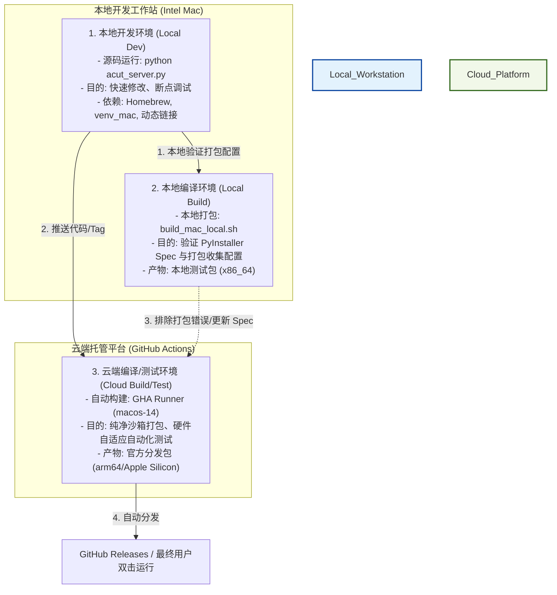

# macOS 开发、编译与云端构建架构指南

本指南详细阐述了 AutoCut 项目在 macOS 系统下的**本地开发环境**、**本地编译环境**与**云端编译环境**三者之间的关系、技术分工以及如何维护“纯净沙箱”以确保发布版本的安全与稳定。

---

## 1. 架构与流程关系图

---

## 2. 三大环境的核心定义与职责

### 💻 本地开发环境 (Local Development Environment) —— “设计工坊”
* **定义**：开发人员日常编写 Python 源码、修改前端 UI、调试逻辑时的运行环境。
* **主要入口**：[run_mac_local.sh](file:///Users/laoniubit/MyPython/AUTOCUT/run_mac_local.sh)
* **核心职责**：
  * **快速迭代**：修改源码后直接通过 `python acut_server.py` 启动，支持代码热重载，无需耗时打包。
  * **深度调试**：可直接挂载 IDE 调试器（Debugger）进行逐行断点调试，排查业务逻辑缺陷。
  * **开发包容性**：允许链接本地 Homebrew 动态安装的各类开发依赖以方便调试。

### 🛠️ 本地编译环境 (Local Compilation Environment) —— “本地打样间”
* **定义**：在开发人员本地物理机上，使用 PyInstaller 和构建脚本将源码和资源组装、打包为独立可执行程序的过程。
* **主要入口**：[build_mac_local.sh](file:///Users/laoniubit/MyPython/AUTOCUT/build_mac_local.sh) 与 [_build_mac.py](file:///Users/laoniubit/MyPython/AUTOCUT/_build_mac.py)
* **核心职责**：
  * **Spec 路径验证**：在本地验证 PyInstaller 的 Spec 文件是否完整收集了所有的静态资源（如 `templates`、`static`、`silero_vad_v6.onnx`）和外部引擎二进制文件。
  * **物理局限性**：受制于当前打包主机的 CPU 架构（如在 Intel Mac 上打包默认只能生成 `x86_64` 程序），且容易混入本地 Homebrew 路径下的动态链接库（`dylib` 污染）。

### ☁️ 云端编译环境 (Cloud Compilation Environment) —— “无尘量产车间”
* **定义**：运行于 GitHub Actions 上的全自动、隔离、无污染的 macOS 虚拟化编译平台。
* **主要入口**：[.github/workflows/build_mac_arm64.yml](file:///Users/laoniubit/MyPython/AUTOCUT/.github/workflows/build_mac_arm64.yml)
* **核心职责**：
  * **跨架构生产**：由于 GHA 提供了 `macos-14` 硬件节点（Apple M1 芯片），使得在本地为 Intel 机器的前提下，也能编译出面向 Apple Silicon（M系列芯片）的原生高性能 `arm64` 包。
  * **完全脱离 Homebrew 依赖**：使用官方纯净的 Python macOS Framework 运行时，配合完全静态编译（Static Link）的 `ffmpeg` 和 `whisper-cli`，生产出可移植性为 100% 的绿色可执行包。
  * **自动化安全门禁**：打包完成后自动运行 ASR 转录和后端 Server API 端点功能测试，任何初始化错误或接口缺陷都将直接阻断发布。

---

## 3. 本地与云端一致性对齐配置（沙箱化规范）

为保证“本地开发”和“云端打包”体验完全对齐，项目采用了以下沙箱化设计：

1. **Python 运行时对齐 (Python 3.12)**
   * 本地虚拟环境创建与云端构建环境均统一指向 **Python 3.12**。
   * [run_mac_local.sh](file:///Users/laoniubit/MyPython/AUTOCUT/run_mac_local.sh) 会优先检测并选用官方 Python.org 框架版，如果使用 Homebrew 替代，则输出安全性警示。

2. **外部引擎静态化**
   * 本地脚本 [setup_mac_deps.sh](file:///Users/laoniubit/MyPython/AUTOCUT/setup_mac_deps.sh) 已改为根据本机架构自动从发布源下载官方**静态链接版 FFmpeg**，废弃了原有的 `brew install ffmpeg` 复制逻辑。
   * 本地编译 `whisper-cli` 时强制传递 `-DBUILD_SHARED_LIBS=OFF` 构建参数，杜绝因本地环境动态链接造成的移植失败。

3. **依赖包版本强锁定 (Locking)**
   * [requirements_mac.txt](file:///Users/laoniubit/MyPython/AUTOCUT/requirements_mac.txt) 锁定所有包 of 确切版本（如 `Flask==3.1.3`、`numpy==2.4.6` 等），防范第三方依赖更新引起的编译崩溃。

4. **安全沙箱隔离 (CORS)**
   * [acut_server.py](file:///Users/laoniubit/MyPython/AUTOCUT/acut_server.py) 的 SocketIO 跨域配置从 `*` 收紧为仅限本地 `http://127.0.0.1:5010` 和 `http://localhost:5010`，防御跨站请求攻击（CSRF/XSS 提权风险）。
