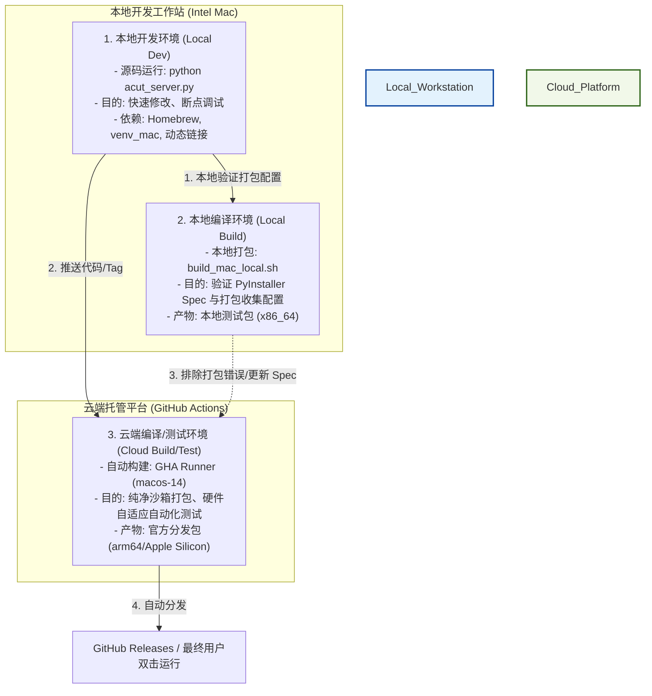

# macOS 开发、编译与云端构建架构指南

本指南详细阐述了 AutoCut 项目在 macOS 系统下的**本地开发环境**、**本地编译环境**与**云端编译环境**三者之间的关系、技术分工以及如何维护“纯净沙箱”以确保发布版本的安全与稳定。

---

## 1. 架构与流程关系图

---

## 2. 三大环境的核心定义与职责

### 💻 本地开发环境 (Local Development Environment) —— “设计工坊”
* **定义**：开发人员日常编写 Python 源码、修改前端 UI、调试逻辑时的运行环境。
* **主要入口**：[run_mac_local.sh](file:///Users/laoniubit/MyPython/AUTOCUT/run_mac_local.sh)
* **核心职责**：
  * **快速迭代**：修改源码后直接通过 `python acut_server.py` 启动，支持代码热重载，无需耗时打包。
  * **深度调试**：可直接挂载 IDE 调试器（Debugger）进行逐行断点调试，排查业务逻辑缺陷。
  * **开发包容性**：允许链接本地 Homebrew 动态安装的各类开发依赖以方便调试。

### 🛠️ 本地编译环境 (Local Compilation Environment) —— “本地打样间”
* **定义**：在开发人员本地物理机上，使用 PyInstaller 和构建脚本将源码和资源组装、打包为独立可执行程序的过程。
* **主要入口**：[build_mac_local.sh](file:///Users/laoniubit/MyPython/AUTOCUT/build_mac_local.sh) 与 [_build_mac.py](file:///Users/laoniubit/MyPython/AUTOCUT/_build_mac.py)
* **核心职责**：
  * **Spec 路径验证**：在本地验证 PyInstaller 的 Spec 文件是否完整收集了所有的静态资源（如 `templates`、`static`、`silero_vad_v6.onnx`）和外部引擎二进制文件。
  * **物理局限性**：受制于当前打包主机的 CPU 架构（如在 Intel Mac 上打包默认只能生成 `x86_64` 程序），且容易混入本地 Homebrew 路径下的动态链接库（`dylib` 污染）。

### ☁️ 云端编译环境 (Cloud Compilation Environment) —— “无尘量产车间”
* **定义**：运行于 GitHub Actions 上的全自动、隔离、无污染的 macOS 虚拟化编译平台。
* **主要入口**：[.github/workflows/build_mac_arm64.yml](file:///Users/laoniubit/MyPython/AUTOCUT/.github/workflows/build_mac_arm64.yml)
* **核心职责**：
  * **跨架构生产**：由于 GHA 提供了 `macos-14` 硬件节点（Apple M1 芯片），使得在本地为 Intel 机器的前提下，也能编译出面向 Apple Silicon（M系列芯片）的原生高性能 `arm64` 包。
  * **完全脱离 Homebrew 依赖**：使用官方纯净的 Python macOS Framework 运行时，配合完全静态编译（Static Link）的 `ffmpeg` 和 `whisper-cli`，生产出可移植性为 100% 的绿色可执行包。
  * **自动化安全门禁**：打包完成后自动运行 ASR 转录和后端 Server API 端点功能测试，任何初始化错误或接口缺陷都将直接阻断发布。

---

## 3. 本地与云端解耦设计与对齐配置

为了兼顾“本地开发的高效轻量”与“云端分发的绝对纯净安全”，项目对环境做出了如下解耦设计：

1. **Python 运行环境解耦**
   * **本地开发**：[run_mac_local.sh](file:///Users/laoniubit/MyPython/AUTOCUT/run_mac_local.sh) 会直接使用您系统 PATH 中的 `python3.12` / `python3.11`，不限制是否为 Homebrew 版本，没有任何警报，确保日常开发体验足够轻量和无感。
   * **云端打包**：自动基于官方 Framework 安装纯净的 Python 3.12 环境进行发布包构建，从源头上杜绝了 Homebrew 的动态链接库（`dylib`）对官方分发包的链接污染。

2. **外部引擎获取逻辑（离线优先）**
   * 本地脚本 [setup_mac_deps.sh](file:///Users/laoniubit/MyPython/AUTOCUT/setup_mac_deps.sh) 采用了**离线优先**的逻辑：如果本地已安装了系统 `ffmpeg`（如通过 Homebrew），则会直接将其复制到 `_internal/` 目录下，不产生任何外网下载流量；只有当本地未安装时，才会下载对应的静态版本作为备用。
   * 本地编译 `whisper-cli` 时，如果系统缺失 `cmake` 工具，脚本将**自动降级**并复用已存在的通用二进制版本，不会报错退出。

3. **依赖包版本强锁定 (Locking)**
   * 本地与云端共享相同的 [requirements_mac.txt](file:///Users/laoniubit/MyPython/AUTOCUT/requirements_mac.txt)，强锁定核心 Python 包的精确版本，防止因为依赖包的自动更新而导致两边运行逻辑漂移。

4. **规范化的版本管理 (VERSION 唯一数据源)**
   * 引入了受 Git 追踪的 [VERSION](file:///Users/laoniubit/MyPython/AUTOCUT/VERSION) 文本文件作为项目版本的唯一事实源。
   * [bump_version.py](file:///Users/laoniubit/MyPython/AUTOCUT/bump_version.py) 会读取并累加该文件，并自动将新版本同步覆盖写入代码文件 [acut_engine.py](file:///Users/laoniubit/MyPython/AUTOCUT/acut_engine.py#L145) 的默认硬编码版本中。这彻底修复了干净克隆仓库编译时因缺失私有 JSON 文件导致编译崩溃的问题，实现了版本迭代的代码级追踪。
   * 发布脚本 [git_push_release.sh](file:///Users/laoniubit/MyPython/AUTOCUT/git_push_release.sh#L50-L56) 改为读取 `VERSION` 文件生成发布 Tag，使代码内部版本与 Git 发布 Tag 永远保持严格对齐。

5. **本地接口跨域隔离 (CORS)**
   * 本地和云端运行时，[acut_server.py](file:///Users/laoniubit/MyPython/AUTOCUT/acut_server.py) 中的 WebSockets 跨域设置均收紧为仅限 `http://127.0.0.1:5010` 和 `http://localhost:5010`，全面保护本地用户不受跨站请求伪造的潜在威胁。

6. **版本控制与依赖升级的完全隔离 (完全解耦)**
   * **核心原则**：项目的版本控制操作（如版本递增、Git Tag 创建、发布推送等）纯粹只管理软件版本代号与源码改动，绝不涉及、也不应该混入第三方依赖环境（如 Python 包、二进制编译工具链）的升级。
   * **职责分离**：依赖环境包的版本锁定（如 `requirements_mac.txt`）以及外部依赖二进制的构建/下载逻辑（如 `setup_mac_deps.sh`）属于单独的安全环境治理。所有的依赖变化应进行独立审计与提交，绝不在版本发布脚本（如 `git_push_release.sh`）中捆绑升级或在提交信息中混淆环境变化。
