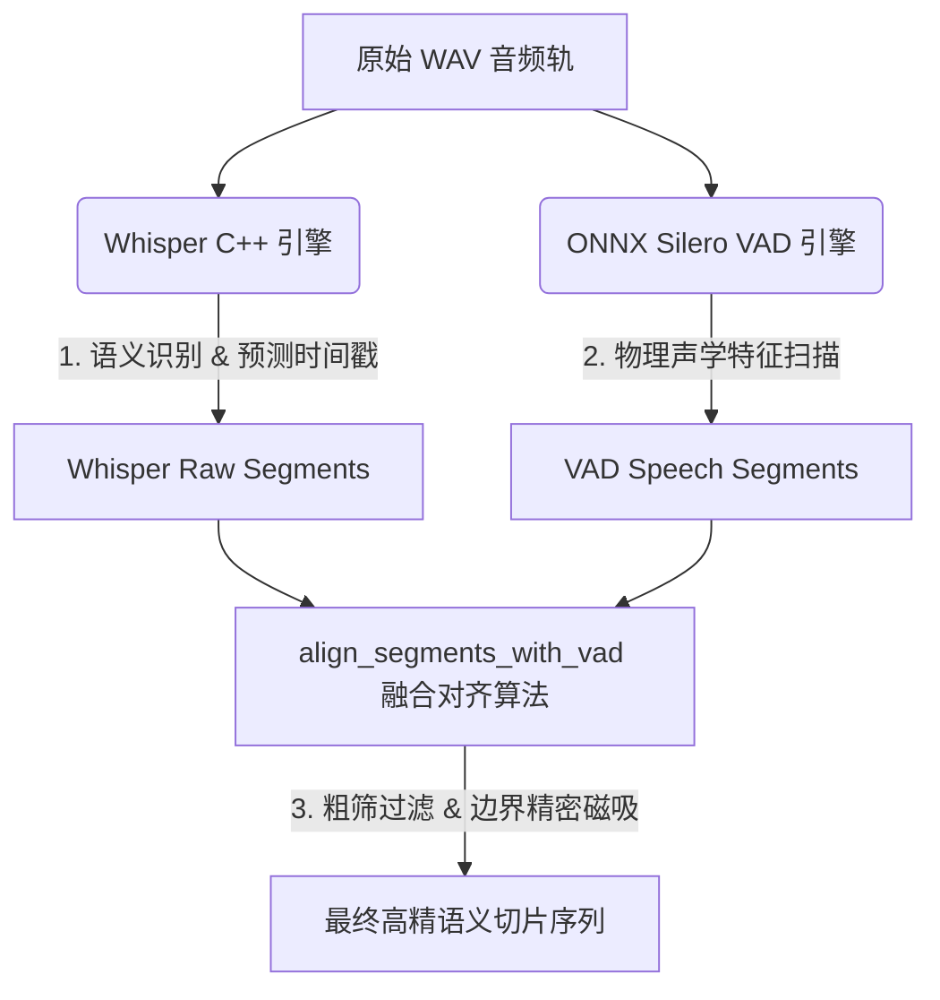

# AutoCut 工业级 AI 剪辑管线：ASR 与 VAD 智能磁吸对齐与静音切除策略说明

本文档详细阐述了 AutoCut 系统中，在 **ASR（自动语音识别）** 与 **VAD（语音活动检测）** 协同工作时的物理声学对齐、静音智能过滤与边界精密裁剪技术细节。该策略是 AutoCut 实现“剪词即剪视频”、保持成片听感“一字不落、废话全无”的底层核心保障。

---

## 一、 核心设计哲学：双 AI 协同架构（Dual-AI Co-Processors）

AutoCut 传统上摒弃了视频剪辑软件中单一阈值的“声音波形门限”切片算法，采用了现代工业级 **“语义脑（ASR） + 物理耳（VAD）”** 的双模型协同处理架构：



1. **语义脑：Whisper C++ 引擎（GGML 硬件加速）**
   * **职责**：只负责**听懂并翻译**。将声音转化为高精度的中文字符，并依据上下文吐出大致的词/句时间戳范围。
   * **局限**：对“起止毫秒”的物理边界感知极弱，且容易受到背景音乐（BGM）、噪声干扰产生幻听。
2. **物理耳：ONNX Silero VAD 引擎（单线程零依赖）**
   * **职责**：只负责**判断有没有人出声**。以毫秒级精度锁定人声发音的起点（Rising Edge）和终点（Falling Edge）。
   * **局限**：看不懂歌词与语义，无法过滤人类的喘气声、哈欠声或单纯的噪音。

两者的交集与融合，由核心算法 `align_segments_with_vad` 完成。

---

## 二、 物理执行生命周期与管道流动

当用户拉起 ASR 识别任务时，系统后台会依次流经以下标准化工业级数据管道：

1. **物理音频提取**：FFmpeg 将视频的音频轨转化为标准的 `16kHz Mono 16bit PCM WAV` 流，保证最高强度的声学纯净度。
2. **Whisper 原生转写**：Whisper 读取 WAV，输出粗筛时间戳 `raw_segments`。
3. **Silero VAD 声学扫描**：Silero VAD ONNX 模型加载并以单线程物理速度快速提取人声在时间轴上的活跃区间 `vad_segments`。
4. **双 AI 联动对齐 (Dual-AI Fusion Alignment)**：运行对齐自愈算子，进行**“判定生死（粗筛）”**与**“收缩边界（精剪）”**。
5. **数据库同步**：将融合后的高纯度切片存入 `semantic_index.json`，供前端 UI 渲染。

---

## 三、 VAD 核心对齐与裁剪三大算子（核心算法机制）

在 `align_segments_with_vad`（位于 `acut_asr.py`）中，算法对每一段 ASR 识别出来的语句进行三状态（Three-State Action）物理裁切：

### 状态 1：粗筛——垃圾/幻听丢弃机制（Silence Discard）

*   **逻辑原理**：Whisper 识别出了一句歌词或杂音，但是经过 VAD 物理扫描，该区间内的 **VAD 活跃相交重合比为零**。
*   **算法拦截**：
    ```python
    overlaps = []
    for v in vad_segments:
        overlap = max(0.0, min(s_end, v_end) - max(s_start, v_start))
        if overlap > 0:
            overlaps.append((overlap, v))
            
    if not overlaps:
        # 判定为静音区幻听，直接物理抹除该段 ASR
        continue
    ```
*   **价值**：完美剪掉了因背景音大、BGM 乐器冲突导致的所有“字幕幻觉”。

### 状态 2：精剪——边界磁吸收缩与对齐（Snap-to-Edge）

*   **逻辑原理**：对于确定有人说话的 ASR 片段，其重合度占比达到安全阈值（$\ge 40\%$）。此时 VAD 作为精密标尺，强制将 Whisper 模糊的左右时间戳“吸附”到最近的物理人声发音边缘上，向内裁剪。
*   **算子公式**：
    $$new\_start = \max(s\_start, matched\_vads\_first.start)$$
    $$new\_end = \min(s\_end, matched\_vads\_last.end)$$
*   **物理效果**：
    *   **切除说话前的气音**：剪去 `s_start` 到真实说话起点之间的换气、喘息或吞咽声。
    *   **切除说话后的余音**：剪去话毕后叹气、背景乐回音、或者由于空气振动残留的几百毫秒无意义杂音。
    *   **成片效果**：切割出来的视频声音“人声一亮即出，人声一熄即斩”，紧凑感拉满。

### 状态 3：安全回退降级（Whisper Native Fallback）

*   **逻辑原理**：如果某个 ASR 片段中确实有人发声，但由于声学环境极为恶劣，重合度低于 $40\%$。
*   **算法拦截**：系统将自动退回到安全线——直接保留 Whisper 原生输出的起止时间戳，确保用户口中的词汇绝对不会因为 VAD 的极端判断而被粗暴切断。

---

## 四、 工业级稳定性与物理防线设计

1. **抗重叠冲突（Anti-Overlap Barrier）**：
   在精剪磁吸后，若相邻的两个片段因边界吸附靠得过近，算法会自动运行重叠冲突防线：
   $$seg2.start = \max(seg2.start, seg1.end)$$
   确保前后两句话在物理合并拼接时，时间轴绝对递增，FFmpeg 分片拼接绝不会引发“时间戳倒流”导致的物理爆音或视频跳帧。
2. **多核单线程隔离运行（Resource Containment）**：
   ONNX 版本的 Silero VAD 运行在独立的 CPU 单线程上（`intra_op_num_threads=1`），完全摆脱了 PyTorch 等大型重度依赖库，且在并行 AI 扫描时能够锁死内存，保证在低配工业电脑上绝不会因为内存溢出而引发崩溃。

---

通过这套双模型协同、粗精双阶对齐的 ASR VAD 策略，AutoCut 将视频中的人声纯净度与切片边界精度推向了工业级的极限，在成片中实现了完全“去水分、去冗余”的高品质紧致听感。
