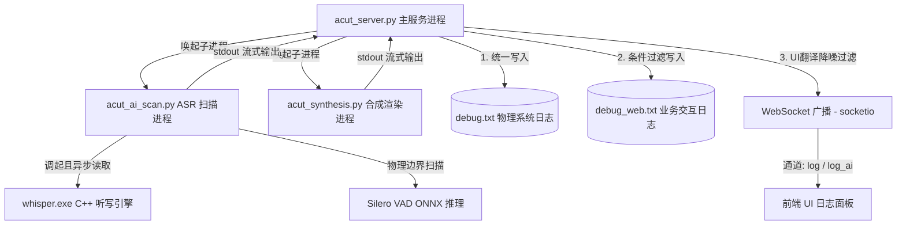
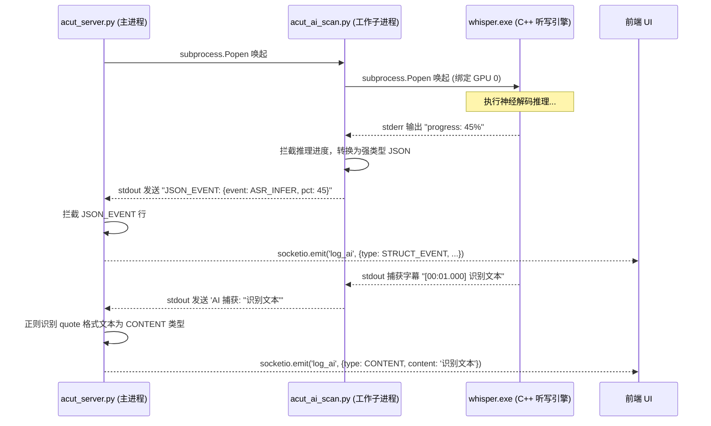

# AutoCut 日志处理流程与架构深度分析

AutoCut 采用了一套专为工业级稳定性设计的**三层日志管理引擎 (Triple-Tier Logging Engine)**，横跨主进程、独立 ASR 分析子进程、合成渲染子进程以及底层的 C++ 听写引擎。该设计在保证底层细节完整物理留档的同时，实现了前端 UI 的高频降噪与友好翻译展示。

---

## 一、 系统日志架构设计概述

系统日志体系主要涉及以下核心组件的联动：

### 1. 物理日志存储层

*   **`_internal_/STARTUP_ERROR.TXT` (启动崩溃哨兵)**:
    在系统导入任何依赖或初始化 logging 之前，使用最基础的 `traceback` 捕获所有致命异常，防止系统静默闪退，确保现场物理留档。
*   **`_internal_/debug.txt` (Tier 1: 系统级物理原始日志)**:
    系统冷启动时清空，运行中无条件追加后端产生的所有物理日志、子进程输出、异常栈信息。
*   **`_internal_/debug_web.txt` (Tier 2: 业务交互原始日志)**:
    系统冷启动时清空，仅在 `channel == 'web'` 或日志文本中包含特定业务特征（如 `API_HIT`、`接收指令`、`License` 等）时写入，用来审计 Web API 交互和授权验证事件。

### 2. 日志广播通信层 (Tier 3)

后端主进程 (`acut_server.py`) 内部的 `audit_log()` 是全局日志的分发枢纽，通过 `Flask-SocketIO` 实时推送日志至前端：
*   **`log` 通道**: 传送系统通用状态日志与合成引擎进度。
*   **`log_ai` 通道**: 专门用于流式传输 ASR 分析详情与 DeepSeek 筛选日志。

---

## 二、 核心机制剖析

### 1. 工业级 telemetry 翻译与降噪过滤 (`translate_to_ui`)

为避免低效、高频的底层物理操作日志（如字幕 Shard 切片、FFmpeg 命令行参数等）冲垮前端 UI 界面并干扰用户，`acut_server.py` 实现了一个基于白名单和正则表达式的翻译过滤函数 `translate_to_ui(msg)`：

*   **进度正则匹配与美化**:
    *   将 `[DeepSeek] Progress: 80%` 翻译为：`[AI Selector] 正在调度 DeepSeek 筛选语义切片并优化剪辑流... 进度 80%`
    *   将 `Progress: 45%` 翻译为：`[Render Engine] 正在拉起 FFmpeg 物理拼接 Shard 序列，并基于 ASS 轨道执行软字幕硬烧录... 进度 45%`
*   **白名单状态翻译**:
    将底层裸状态如 `Initializing Global Cold Start`、`正在初始化 AI 模型` 映射为高可读性的工业技术文案（如 `[SYSTEM] 初始化全局冷启动：正在清理孤立的物理锁以恢复环境...`）。
*   **高严重性穿透逻辑**:
    如果 `translate_to_ui(msg)` 返回 `None`，但日志级别（`level`）是 `ERROR`、`SUCCESS` 或 `WARNING`，则该日志会直接**穿透**过滤器，将原始文本推送给前端，确保警报信息绝对不丢失。

---

## 三、 ASR 分析识别日志流 (`acut_ai_scan.py`)

当用户触发 `start_ai` 事件，主服务会拉起 `acut_ai_scan.py` 工作进程。该子进程的日志处理流程极为精密：

### 1. 强类型 JSON 事件拦截 (`JSON_EVENT`)
在 ASR 扫描进程中，为了向前端提供平滑的百分比进度条：
*   工作子进程内部的 `_log` 方法会实时监控 `whisper.exe` 产生的 stderr 输出。一旦捕获到包含 `Inferencing` 的进度信息，就会提取数字百分比，以 `JSON_EVENT: {"event": "ASR_INFER", "pct": <pct>}` 的格式输出到 stdout。
*   主服务进程通过 `process.stdout.readline` 流式读取子进程输出时，一旦检测到行首是 `JSON_EVENT: `，会立即拦截、反序列化为 JSON，并向前端广播 `type: 'STRUCT_EVENT'`。

### 2. C++ 听写引擎流式管道拉取 (`acut_asr.py`)
由于 `whisper.exe` CLI 是通过进程管道进行通信，为防止管道缓存区满（Windows 默认为 64KB）导致子进程死锁挂起，`acut_asr.py` 内部创建了两个异步守护线程进行“管道排空”：
*   **`drain_stdout`**:
    专门从 stdout 中提取 `[00:00:00.000 --> 00:00:05.000] Text` 格式的文本，清洗干扰字符后以 `AI 捕获: "{text}"` 格式传给 `_log` 方法，再打印出来。
*   **`drain_stderr`**:
    解析 whisper 控制台 stderr 的进度信息（例如 `progress` 转换成 `AI Inferencing: {pct}%`），以及检测模型成功物理装载的时间、内核神经编码器耗时、语义解码器耗时等，并返回给主进程记录。

---

## 四、 视频拼接合成日志流 (`acut_synthesis.py`)

当用户触发 `start_batch` 视频拼合渲染时，系统日志流程如下：

1.  主服务进程创建独立子进程运行 `acut_synthesis.py`。
2.  **物理切片渲染阶段**:
    在 `solidify_physical_slices` 函数中，对每个切片进行 FFmpeg 渲染。渲染成功后，子进程会向 stdout 打印 `[Render Engine] Progress: {百分比}%`。
3.  **主进程管道捕获**:
    主进程 `acut_server.py` 在 `stdout.readline` 循环中拿到该行，识别到 `Progress` 特征，设置 `is_progress=True`，并传入 `audit_log`。
4.  **UI 翻译层转化**:
    通过 `translate_to_ui` 将其转换为对用户友好的技术短语：`[Render Engine] 正在拉起 FFmpeg 物理拼接 Shard 序列，并基于 ASS 轨道执行软字幕硬烧录... 进度 X%`，最终通过 WebSocket 推送至前端进度条。
5.  **完成信号**:
    合成成功后，子进程输出 `SUCCESS: Synthesis complete. Final file: {out_p}`，该物理成功信号会直接穿透降噪层广播至前端，使前端状态机安全解开界面锁定。

---

## 五、 日志处理流程总结表

| 阶段 | 产生日志的文件 | 日志内容特征 | 主进程处理动作 | 前端呈现形式 |
| :--- | :--- | :--- | :--- | :--- |
| **系统启动** | `acut_server.py` | `--- Cold Boot ---` | 初始化物理文件，静默 `werkzeug` 控制台 | UI 提示 "服务已在线" |
| **音频提取** | `acut_ai_scan.py` | `正在提取音频轨道...` | 物理写入 `debug.txt`，UI 降噪转换 | UI 日志面板展示 `[DISK_IO] 正在从视频中提取...` |
| **ASR 模型加载**| `acut_asr.py` (C++) | `whisper_model_load ... done` | 捕获模型装载、神经编码/文本解码耗时 | ASR 详细日志展示 |
| **ASR 推理进度**| `acut_ai_scan.py` | `JSON_EVENT: {"event": "ASR_INFER", "pct": X}` | 拦截并提取 `pct` | AI 状态条更新百分比进度 |
| **字幕流式捕获**| `acut_asr.py` (C++) | `AI 捕获: "..."` | 正则识别并标记为 `CONTENT` 类型 | ASR 面板流式打字机式滚动呈现识别词 |
| **声学边界对齐**| `acut_asr.py` | `AI 正在扫描声学物理边界...` | 物理记档并广播 | UI 日志面板显示 `[ASR Performance] VAD 扫描耗时` |
| **视频分片渲染**| `acut_synthesis.py` | `[Render Engine] Progress: X%` | 识别为进度，进入 `translate_to_ui` | 进度条递增，显示 "正在拉起 FFmpeg 拼接..." |
| **物理拼接完成**| `acut_synthesis.py` | `SUCCESS: Synthesis complete...` | 识别为 `SUCCESS` 级别，无条件穿透 | UI 弹窗提示 "合成成功"，解除锁定 |
